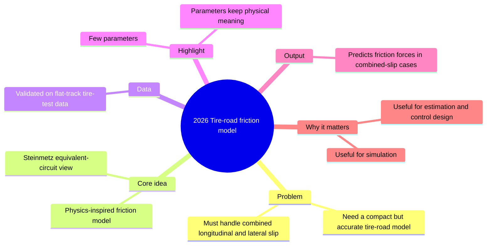
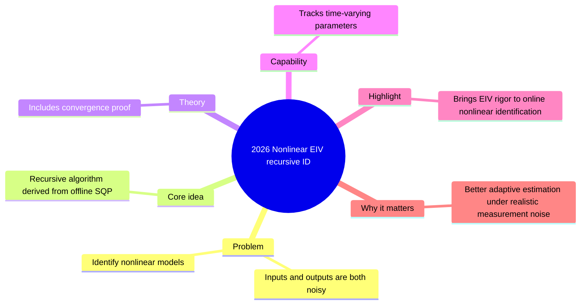
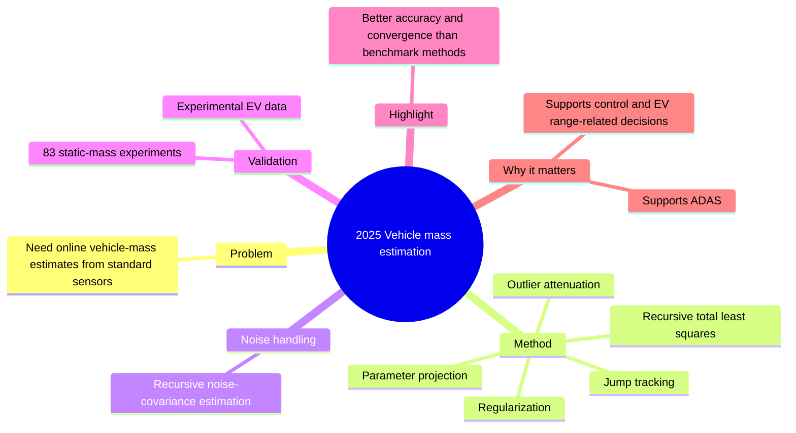
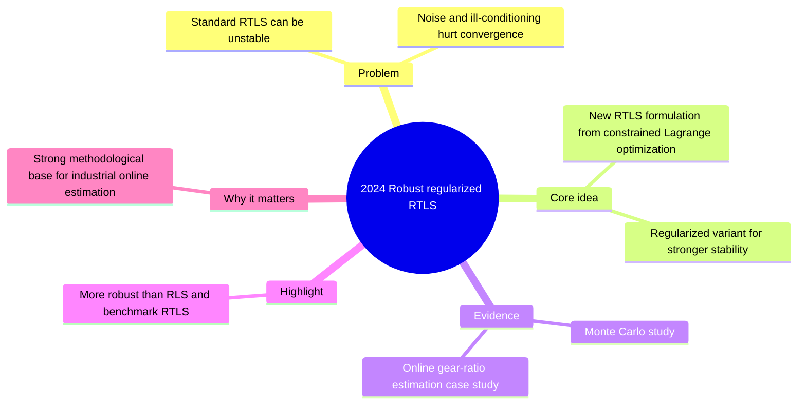
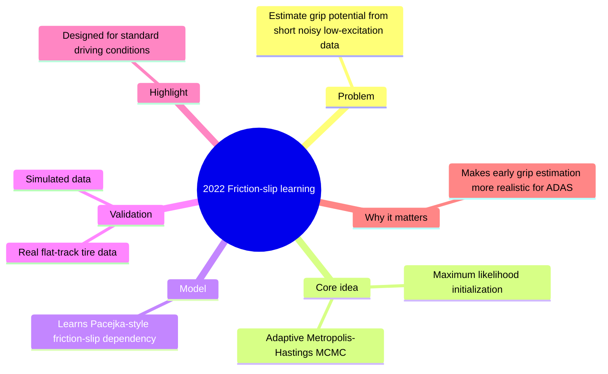

# Michelin / R&D Application Conversation Export

- Exported: 2026-09-16
- Project: `/Users/hou/Projects/PersonalPage`
- Scope: visible user messages and assistant replies from this chat, reconstructed from the available conversation context
- Excluded: internal reasoning, raw tool calls, raw command output, and hidden system/developer instructions
- Note: this file was created with a unique filename and did not overwrite any existing markdown file.

---

## User

you are a top-level industry R&D team leader of Michelin company (on simulation and data science), and yourself has the experience of transferring from fundemental physics research to a industry innovation role. 
Review carefully the materials that I'll send to you later, and based on the material itself, tell me:
1. if you want hire the person as part of your team (applied as spontaneous applicant)
2. what interest you the most
3. if you decide not to hire this person, why? 

## Assistant

Send the materials when ready.

Best inputs are:
- CV/resume
- cover letter or spontaneous application email
- publication list or selected papers/patents
- project summaries
- any statement about motivation for Michelin / industry transition

I’ll review them as if I were hiring for a Michelin R&D simulation/data science team, and I’ll answer in this structure:
1. `Hire / No hire / Maybe`
2. What is most compelling
3. If not hire, the concrete reasons

If you want, I can also give:
- a strict hiring-manager view
- a more encouraging developmental view
- both, side by side

Paste the materials directly or upload them.

---

## User

file:///Users/hou/Projects/PersonalPage/index.html

## Assistant

Based on [index.html](/Users/hou/Projects/PersonalPage/index.html) and the linked [resume.html](/Users/hou/Projects/PersonalPage/resume.html), my assessment is:

1. I would move this person forward, and for the right Michelin R&D role I would be hire-leaning.
This is not a generic “physics PhD applying to industry” profile. What is credible here is the repeated ability to work on noisy measurements, imperfect simulations, calibration, validation, and uncertainty-aware decision support. That is directly relevant to simulation and data science in industrial R&D. I would see this person as a strong candidate for roles around model validation, test-data interpretation, simulation-to-experiment correlation, sensor/system analysis, or advanced data analysis for physical systems.

2. What interests me the most is the recurring technical pattern, not just one project.
The strongest signal is that this person does not treat simulation as truth. They repeatedly:
- identify mismatch between model and measurement,
- build correction or calibration workflows,
- validate aggressively before trusting results,
- keep the method reusable and auditable.

That is exactly the mindset I want in industrial innovation teams. The most compelling examples are:
- `Sensor Simulation & Reconstruction`: using beam-test data to constrain simulation rather than assuming ideal response.
- `Calibration & Response Correction`: turning a persistent correlation into an explicit correction model.
- `Data Quality Monitoring`: tracing discrepancies back to detector or software causes instead of stopping at plots.
- `Simulation Correction Workflow`: converting measured constraints into reusable event-level correction tooling.

This tells me the candidate understands the hard part of industrial modelling: the real problem is rarely “build a model,” it is “make the model trustworthy enough to support decisions.”

3. If I decide not to hire, it would not be because of lack of technical depth.
It would be for fit-risk reasons visible in the material:
- The dossier is still more “research portfolio translated for industry” than “proven industrial delivery record.”
- I do not yet see business impact, product impact, cost/time gains, or decision ownership stated concretely.
- I do not see evidence yet of work with manufacturing, product, test, or operational stakeholders outside research collaborations.
- The profile is strongest for physics-heavy modelling/validation roles, not for broad data-science roles or software/product roles.
- The written material is technically strong, but the English presentation still has some phrasing issues; for a spontaneous application, sharper communication would help.

So my short answer is: yes, I would seriously consider this person and likely invite them to interview. If I rejected them, it would be because I could not map them to a specific industrial role quickly enough, not because the underlying technical profile is weak.

---

## User

yes

## Assistant

**Hiring Committee View**

**Green Flags**
- Strong technical depth in exactly the hard regime that matters in physical R&D: noisy measurements, imperfect simulation, calibration, bias correction, validation.
- Repeated evidence of the right scientific instinct: not trusting simulation blindly, but forcing simulation-to-measurement alignment.
- Good transfer signal from academia to industry. The projects are framed around reliability, traceability, uncertainty, and decision support, not only around publication novelty.
- Experience with reusable workflows, shared codebases, and collaborative review culture. That matters.
- Best examples are the sensor simulation/reconstruction, calibration/correction, data-quality monitoring, and simulation-correction workflow. Those feel closest to industrial value creation.

**Red Flags**
- I do not yet see direct industrial execution: product constraints, timelines, cross-functional stakeholders, business tradeoffs, deployment, or operational ownership.
- The profile is still positioned a bit too broadly: “physics modelling & simulation | data scientist.” For a spontaneous application, that is too open. I would want a much sharper target role.
- There is little quantified impact in industrial terms. I see technical impact, but not enough “this changed a decision / reduced uncertainty / saved test cycles / improved model fidelity by X.”
- The material shows strong analysis and modelling, but less evidence of end-to-end industrial software delivery.
- Communication is good in substance, but still not yet polished enough for a spontaneous applicant competing against candidates with cleaner industrial narratives.

**What I Would Conclude**
- `Recommendation: Maybe -> interview`
- I would not reject this profile at screening.
- I would invite for interview if I had an opening in simulation, model validation, test-data interpretation, or advanced analytics for physical systems.
- I would be much less interested for a generic “data scientist” role, and I would likely reject for a software-engineering-heavy role.

**Why Not Immediate Hire**
- The main risk is not intelligence or technical level.
- The main risk is role translation: can this person move from technically excellent research workflows to industrial R&D problems with constraints on speed, scope, stakeholder alignment, and business usefulness?

**What Would Decide It in Interview**
- Can the candidate explain their work in engineering terms rather than particle-physics terms?
- Can they prioritize under imperfect data and limited time?
- Can they connect model improvement to an actual decision?
- Can they work with experimentalists, test engineers, and non-specialists without overcomplicating the solution?

**Bottom Line**
For my team, this is a serious candidate, not a courtesy interview.  
But I would hire only into a narrowly defined role where simulation credibility, calibration, validation, and inference under uncertainty are central. If the role is vague, the application becomes risky.

---

## User

yes

## Assistant

**First 2 Minutes**
A skeptical Michelin hiring manager could react like this:

- “This person is clearly smart, but I still don’t know what exact role they want.”
- “This reads like an academic profile translated toward industry, not an industrial profile built from industrial outcomes.”
- “There is a lot of method, but not enough decision impact.”
- “I see detector physics, collaborations, and analysis frameworks. I do not yet see manufacturing, product development, testing, durability, materials, or operations.”
- “For a spontaneous application, this asks me to do too much interpretation work.”

**What They Would Criticize**
- The positioning is too broad: `Physics Modelling & Simulation | Data Scientist | Applied Inference / Validation` is not a job title.
- The portfolio explains technical sophistication well, but not business usefulness well enough.
- Many project descriptions still sound research-native: interesting scientifically, but not obviously tied to industrial constraints like speed, robustness, cost, integration, or decision support.
- There is little quantified impact in manager language: reduced bias by how much, improved prediction quality by how much, enabled what decision, saved what testing effort?
- The transfer argument is intellectually valid, but still mostly asserted rather than proven through industrial examples.
- The materials show strong modelling and analysis, but less evidence of operational deployment, stakeholder management, or shipping tools others depend on.
- Some writing is not polished enough for a spontaneous applicant. Small wording issues make the profile feel less executive-ready than it should.

**What the Skeptical Manager Might Decide**
- “Strong scientist, but too speculative for a spontaneous application.”
- “I would only pursue this if I already had a narrow opening in model validation, simulation correlation, or measurement analytics.”
- “For a general R&D or generic data-science application, I would likely pass.”

**Brutal Bottom Line**
The risk is not “this person is weak.”  
The risk is “this person may be excellent, but I cannot map them to a Michelin problem fast enough.”

That is exactly how strong candidates get rejected in industry.

**What Would Change That Fast**
- One sharp target role.
- A headline in industrial language.
- 3 to 5 bullets translating research into engineering outcomes.
- Concrete impact statements.
- Less proof of intelligence, more proof of usefulness.

---

## User

ok

## Assistant

To get a Michelin hiring manager to say yes to an interview in 30 seconds, the application has to answer four things immediately:

- What role do you want?
- What industrial problem do you solve?
- What proof do you have?
- Why are you useful here, not just impressive?

Right now, [index.html](/Users/hou/Projects/PersonalPage/index.html) and [resume.html](/Users/hou/Projects/PersonalPage/resume.html) show strong capability, but they still make the manager do too much translation.

**What To Change**
- Pick one primary target: `Simulation & Data Science Engineer for Physical Systems` or `R&D Engineer, Model Validation & Test Data Analytics`.
- Stop leading with identity words like `physics modelling specialist` and start with value.
- Lead with the 3 most industry-relevant stories: sensor simulation, calibration/correction, data-quality monitoring.
- De-emphasize the most academic-sounding topics on the first screen: Fourier inference, weak-signal extraction, latent-parameter language.
- Add industrial outcome language: reliability, model credibility, test-data interpretation, faster iteration, auditable decisions.
- Add one explicit sentence on why Michelin-type R&D is the target.

**Homepage Positioning**
Use something closer to this:

`Simulation & Data Science Engineer for Physical Systems`

`I build calibrated models from noisy measurements and imperfect simulations. My work focuses on simulation-to-test alignment, model validation, bias correction, and uncertainty-aware analysis for complex instrumented systems.`

`After several years in large experimental physics collaborations, I am now targeting industrial R&D roles where trustworthy models and well-explained data are needed to support engineering decisions.`

**Resume Summary Rewrite**
Use something closer to this:

`R&D-oriented simulation and data scientist with a background in experimental physics and several years of experience building reusable Python/C++ workflows for calibration, validation, and inference on noisy measurement systems.`

`Core strength: turning imperfect simulations and biased measurements into decision-ready models through simulation-to-data alignment, correction workflows, uncertainty handling, and robust validation.`

`Best fit: industrial R&D teams working on physical systems, instrumented tests, sensor data, model credibility, and simulation-informed engineering decisions.`

**The 4 Bullets A Manager Should See**
- Built simulation-to-measurement workflows that used test data to calibrate model response and quantify system-level performance impact.
- Developed reusable correction and calibration methods to remove structured bias and stabilize model behavior across operating conditions.
- Built monitoring and validation pipelines that traced discrepancies to detector, calibration, or software causes instead of stopping at descriptive analysis.
- Worked in large shared technical environments with reusable code, review discipline, and robustness checks under uncertainty.

**What To Cut From The First Screen**
- Too much particle-physics vocabulary.
- Too many equally weighted case studies.
- Method novelty before engineering usefulness.
- Broad labels like `Physics Modelling & Simulation | Data Scientist`.

**What A Michelin Hiring Manager Should Think After Reading**
- “This person can help us make simulation and test data agree.”
- “This person understands calibration and model trust.”
- “This person can work on physical systems, not just abstract ML.”
- “This is worth an interview.”

---

## User

summarize the dicussion we had into a .md file, and saved at the current path

## Assistant

Saved the summary to [michelin_hiring_review_summary.md](/Users/hou/Projects/PersonalPage/michelin_hiring_review_summary.md).

It includes the hiring assessment, green/red flags, skeptical-manager critique, and the recommendations for making the profile stronger for Michelin-style R&D roles.

---

## User

what about now? 
file:///Users/hou/Projects/PersonalPage/index.html

## Assistant

Yes. It is materially better now.

From a Michelin R&D hiring-manager view, [index.html](/Users/hou/Projects/PersonalPage/index.html) and [resume.html](/Users/hou/Projects/PersonalPage/resume.html) now do the most important thing they did not do before: they tell me quickly what role you want, what problem you solve, and why your background transfers to industrial R&D.

**What Improved**
- The headline is much stronger: `Simulation & Data Science Engineer for Physical Systems` is clearer and more usable than the earlier broader positioning.
- The hero section now speaks in industrial language: `simulation-to-measurement alignment`, `model validation`, `engineering decisions`, `test-data interpretation`.
- The resume summary is significantly better. It now sounds like an industrial R&D candidate, not just a physics postdoc translated into business vocabulary.
- Several project labels are improved for industry readability, especially `Model Correction Workflow` and `Test-Data Validation & Root-Cause Analysis`.

**Updated Hiring View**
- Before: strong profile, but the manager had to do too much interpretation.
- Now: I would be more likely to shortlist for interview.
- My current verdict would be: `Interview`, especially for roles in simulation correlation, model validation, test-data analytics, sensor/system modelling, or uncertainty-aware engineering analysis.

**What Still Holds It Back**
- There is still almost no quantified impact in industrial terms.
- There is still no Michelin-specific motivation or explicit connection to tire, materials, vehicle, manufacturing, or test environments.
- Some academically framed projects are still prominent on the homepage, especially `Fourier-Based Inference` and `Weak-Signal Inference`.
- I still do not see much evidence of adoption by non-expert users, operational deployment, or decisions influenced by the work.

**Bottom Line**
This version is no longer “interesting but risky.” It is now “credible and interviewable.”

---

## User

update these review comments into michelin_hiring_review_summary.md

## Assistant

Updated [michelin_hiring_review_summary.md](/Users/hou/Projects/PersonalPage/michelin_hiring_review_summary.md).

It now includes:
- the improved post-revision assessment,
- what got better,
- the updated hiring view,
- the remaining gaps,
- and a revised final conclusion reflecting the current state.

---

## User

what about this version file:///Users/hou/Projects/PersonalPage/index.html

## Assistant

This is the strongest version so far.

If I were screening this for a Michelin R&D simulation/data-science team, I would now move it to a clear `interview yes`. The earlier versions were “strong but requiring interpretation.” This one is much closer to “this person understands how to present themselves for an industrial physical-systems role.”

What improved most in [index.html](/Users/hou/Projects/PersonalPage/index.html) and [resume.html](/Users/hou/Projects/PersonalPage/resume.html):
- The Michelin fit is now explicit, not implied.
- You added quantified evidence, which matters a lot: `<1%` constant-term contribution, about `factor 2` improvement, recovered fraction close to injected truth.
- The project ordering and naming are better. `Advanced Inference Method Validation` is easier to accept than a pure Fourier-method title, and `Pulse-Shape Discrimination for Energy Reconstruction` is more concrete than the older calibration story.
- The overview now argues from proof, not just from themes.

My updated hiring view:
1. I would interview this person.
2. What interests me most is still the same core pattern: simulation-to-measurement alignment, bias correction, validation discipline, and turning imperfect models into decision-usable tools. The new quantified examples make that much more credible.
3. I would still hesitate on immediate hire only if I needed direct proof of industrial delivery, stakeholder ownership, or business impact.

Two remaining cautions:
- If this is a general public portfolio, naming Michelin directly on the homepage is risky. It works for a Michelin-targeted application version, but not as the only universal version.
- Some detailed sections still carry too much field-specific vocabulary. That is fine in the expanded sections, but the top-level takeaway should keep emphasizing engineering consequence over physics context.

Bottom line: this version crosses the line from “interesting candidate” to “credible Michelin interview candidate.”

---

## User

ok good. write it in the michelin_hiring_review_summary.md.
also, how can this be more generic to other same role but from different companies? 

## Assistant

Updated [michelin_hiring_review_summary.md](/Users/hou/Projects/PersonalPage/michelin_hiring_review_summary.md).

I added:
- the latest review stating this is now a clear Michelin interview-level version,
- the strongest improvements in this revision,
- the remaining cautions,
- and a new section on making the profile reusable across similar roles at other companies.

For making it more generic, the right strategy is not one fully neutral version only. Keep:
- one strong base version with company-neutral positioning,
- one Michelin-tailored version,
- and lightweight variants for other targets.

The base version should keep:
- `Simulation & Data Science Engineer for Physical Systems`
- simulation-to-measurement alignment
- calibration and model validation
- quantified proof points
- cross-industry project stories

Then only swap:
- one motivation sentence,
- one company-context paragraph,
- and, if needed, the project order.

The main rule is simple: remove `Michelin` from the public base version, but keep a tailored Michelin copy for actual applications.

---

## User

just one thing, in the index.html, word `michelin` only appears once, in "That is why R&D environments like Michelin's are a strong...." can I just remove it from the sentence to make it generic? 

## Assistant

Yes.

That is the cleanest fix for a generic version. The sentence structure already works; you only need to remove the company name.

Use:

`That is why these kinds of R&D environments are a strong fit: complex physical systems, instrumented tests, imperfect models, and engineering decisions that depend on model credibility rather than raw simulation output.`

Or slightly stronger:

`That is why industrial R&D environments working on complex physical systems are a strong fit: instrumented tests, imperfect models, and engineering decisions that depend on model credibility rather than raw simulation output.`

The second version is better if you want it to stay generic while still sounding targeted.

---

## User

file:///Users/hou/Projects/PersonalPage/index.html

## Assistant

Yes. [index.html](/Users/hou/Projects/PersonalPage/index.html) is now much better as a generic base version.

Removing `Michelin` was the right move. The page still feels targeted to the right kind of role, but it no longer looks customized for only one company. From a hiring-manager view, this remains a clear interview-level profile for simulation, model validation, test-data analytics, and physical-systems R&D roles.

The only thing I would still polish is the repetition in the hero copy. You already say `I am now targeting industrial R&D teams...`, then the next paragraph starts `I am targeting industrial R&D teams...` again. I would tighten that third paragraph to:

`This is strongest fit in industrial R&D environments working on complex physical systems, where instrumented tests, imperfect models, and engineering decisions must stay aligned under uncertainty.`

That keeps it generic and reads more cleanly.

---

## User

update your comments in the md file

## Assistant

Updated [michelin_hiring_review_summary.md](/Users/hou/Projects/PersonalPage/michelin_hiring_review_summary.md).

It now includes:
- the latest assessment after removing `Michelin` from the homepage,
- the conclusion that this is now a stronger generic base version,
- and the remaining minor polish point about repeated wording in the hero section.

---

## User

file:///Users/hou/Projects/PersonalPage/index.html
file:///Users/hou/Projects/PersonalPage/resume.html

## Assistant

This is now strong.

Based on [index.html](/Users/hou/Projects/PersonalPage/index.html) and [resume.html](/Users/hou/Projects/PersonalPage/resume.html), my hiring view is now a clear `interview yes` for Michelin-type simulation, model validation, test-data analytics, and physical-systems R&D roles. The homepage reads cleanly, the generic positioning works, and the resume now supports it with stronger evidence: `<1%` constant-term contribution, `~2x` PSD-related resolution improvement, and clearer statements that validation work led to calibration updates, software follow-up actions, and better modelling decisions.

The biggest improvement is that the story now feels coherent across both pages. The homepage says what role you want and what problem you solve; the resume backs that up with concrete proof. The current hero copy is much better than before, and removing `Michelin` from the homepage was the right move for a reusable public version.

What still keeps it from being fully finished is minor, not structural. The remaining gaps are mostly:
- some expanded project sections still have a lot of field-specific language
- the resume highlights section is a bit more academic than the rest of the profile
- the impact is now better, but still mostly technical rather than business/engineering-outcome language

So the answer is: this version is ready enough to support applications. It now looks like a credible candidate for industrial R&D roles in physical-system modelling and validation, not just an academic trying to translate themselves.

---

## User

yes, do it

## Assistant

This is already submission-ready. The last 5 edits I’d make are:

1. Add a `Selected Outcomes` block near the top of [resume.html](/Users/hou/Projects/PersonalPage/resume.html), and optionally a shorter version in [index.html](/Users/hou/Projects/PersonalPage/index.html). If a hiring manager reads only one thing, this should carry the proof:
- `Quantified response non-uniformity contribution to resolution below 1% in a detailed detector study`
- `Improved reconstructed-energy resolution by about 2x in representative PSD-based studies`
- `Built validation workflows that exposed detector/software issues, including a missing-energy bug later fixed downstream`

2. Rewrite the `Technical Highlights` section in [resume.html](/Users/hou/Projects/PersonalPage/resume.html) into more industrial language. Right now it is still the most academic part of the resume. I’d use:
- `Model validation and uncertainty quantification for noisy measurement systems`
- `Simulation-to-measurement alignment through calibration, reweighting, and correction`
- `Sensor and system modelling with Geant4, ROOT, Python, and C++`
- `Test-data analytics, anomaly tracing, and root-cause diagnosis`
- `ML validation under dataset shift for decision-facing pipelines`

3. Tighten the last paragraph of the resume summary in [resume.html](/Users/hou/Projects/PersonalPage/resume.html) so it sounds more concrete and less generic. A stronger version would be:
`Track record: delivered validation and correction workflows that fed calibration updates, software fixes, and quantified model improvements under uncertainty.`

4. Keep the strongest four homepage case studies exactly where they are, but visually separate the two most academic ones at the end of [index.html](/Users/hou/Projects/PersonalPage/index.html) under something like `Additional Statistical Methods`. That keeps depth without letting them compete with the more industrial stories.

5. Shorten 2 or 3 long experience bullets in [resume.html](/Users/hou/Projects/PersonalPage/resume.html) by about 20%. The content is strong, but slightly denser than a hiring manager wants on first pass. Example:
- Current: long collaboration/validation sentence
- Better: `Worked in large technical collaborations with shared codebases and review discipline, with validation outputs feeding calibration and model decisions.`

If you only do one more change, do `#1`. That gives the fastest improvement in screening value.

---

## User

write these into the md file

## Assistant

Updated [michelin_hiring_review_summary.md](/Users/hou/Projects/PersonalPage/michelin_hiring_review_summary.md).

It now includes the final submission-readiness section with:
- the last 5 recommended edits,
- the suggested wording,
- and the priority order for what to change first.

---

## User

file:///Users/hou/Projects/PersonalPage/index.html

## Assistant

This version is strong. [index.html](/Users/hou/Projects/PersonalPage/index.html) now looks submission-ready for the target role family.

The biggest improvements are all in place:
- the hero is clear and industry-readable ([index.html](/Users/hou/Projects/PersonalPage/index.html))
- `Selected Outcomes` is exactly the kind of fast proof a hiring manager wants ([index.html](/Users/hou/Projects/PersonalPage/index.html:66))
- the more academic work is now separated under `Additional Statistical Methods`, which is the right structure ([index.html](/Users/hou/Projects/PersonalPage/index.html:220))

From a hiring view, this stays a clear `interview yes` for simulation, model validation, test-data analytics, and physical-systems R&D roles.

Only minor polish remains:
- `Best fit` in the opening paragraph and `strongest fit` in the sidebar are slightly repetitive.
- `The strongest proof repeats across multiple cases...` is good, but a little dense; you could shorten it if you want a tighter first read.
- Some project details are still technical, but now they are in the right place and no longer hurt the first impression.

If you stop here, that is reasonable. This version is already in good shape.

---

## User

ok, I'm going to submtting. can you point me the way to submit the spontaneous application to Michelin? 

## Assistant

Yes. As of **April 14, 2026**, the safest official route is:

1. Go to Michelin’s careers site: [recrutement.michelin.fr](https://recrutement.michelin.fr/)
2. Click **“Je découvre les offres” / “Voir nos offres”** to open the jobs portal: [job list](https://recrutement.michelin.fr/en/job-offer-result-list)
3. Create a candidate profile / apply through the portal.
4. If you want a true spontaneous application, Michelin’s official terms explicitly say the site allows **“envoyer une candidature spontanée”** and says they send an acknowledgment within **48 hours**: [Conditions d’utilisation](https://recrutement.michelin.fr/conditions-d-utilisation)

Important nuance: I found the official statement that Michelin accepts spontaneous applications, but I did **not** find a clearly surfaced public button labeled “candidature spontanée” on the pages I checked. So in practice, I would do one of these two:

- **Best option:** apply to the closest live R&D role and use the cover letter to position yourself for adjacent simulation/data-science roles.
- **Backup option:** use a relevant **Talent Pool** posting if one exists for your target area.

For your profile, current official Michelin roles that look especially relevant include:
- [Leader Technique Simulation Numérique / EF (F/H) – CDI](https://recrutement.michelin.fr/en/job-offer-result-list/leader-technique-simulation-num%C3%A9rique-slash-ef-f-slash-h-cdi), published **April 3, 2026**, Clermont-Ferrand
- The main job list also showed **“Expert·e modélisation du mélangeage de matériaux polymériques (F/H)”**, published **April 3, 2026**, Clermont-Ferrand: [job list](https://recrutement.michelin.fr/en/job-offer-result-list)

If you want a human follow-up path, Michelin also has an official recruiter page with the **R&D recruiters** listed: [Contactez nos recruteurs](https://recrutement.michelin.fr/contactez-nos-recruteurs)

My recommendation:
- submit through the official portal first
- target the closest open R&D role
- then use your cover letter to say you are also applying spontaneously for adjacent simulation / model-validation / test-data roles in Michelin R&D

Sources:
- [Careers home](https://recrutement.michelin.fr/)
- [Application process](https://recrutement.michelin.fr/en/jobsearch/application)
- [Conditions d’utilisation](https://recrutement.michelin.fr/conditions-d-utilisation)
- [Recruiter contacts](https://recrutement.michelin.fr/contactez-nos-recruteurs)
- [Current job list](https://recrutement.michelin.fr/en/job-offer-result-list)

---

## User

would it be better to directly reach out to the. R&D recruiters? 

## Assistant

Yes, but as a supplement, not a substitute.

Best approach:
1. Apply first through Michelin’s official portal to the closest open R&D role or talent pool: [jobs portal](https://recrutement.michelin.fr/en/job-offer-result-list)
2. Then contact an R&D recruiter with a short note saying:
   - you applied
   - the role title / link
   - why your profile fits Michelin R&D
   - that you’d also like to be considered for adjacent simulation / model-validation / test-data roles
3. Include your CV, portfolio link, and application reference if you get one.

Why this is better:
- Michelin’s official application page says candidates can contact the recruiting team directly if they still have questions: [Your Application](https://recrutement.michelin.fr/en/jobsearch/application)
- Michelin also has an official recruiter page listing R&D recruiters: [Contactez nos recruteurs](https://recrutement.michelin.fr/contactez-nos-recruteurs)
- But the official site still centers the formal application route, and their legal page says spontaneous applications are handled through the site: [Conditions d’utilisation](https://recrutement.michelin.fr/conditions-d-utilisation)

For R&D, the official page currently lists:
- Anne Aubert Lopez
- Quentin Bonneton
- Thomas Verhaeghe  
Source: [Recruiter page](https://recrutement.michelin.fr/contactez-nos-recruteurs)

So the practical answer is:
- `Direct outreach only` = not ideal
- `Portal only` = acceptable
- `Portal first, then short recruiter outreach` = best

---

## User

as the way to spontanee application, which one is better for me to apply? Leader technique or expert modelisation? 

## Assistant

If you apply to only one, **apply to `Leader Technique Simulation Numérique / EF (F/H)`**.

**Why this one is closer**
- It is explicitly about **numerical simulation, HPC, data-science, model robustness, and R&D support** at Michelin’s Physics & Modelling department ([job page](https://recrutement.michelin.fr/job-offer-result-list/leader-technique-simulation-num%C3%A9rique-slash-ef-f-slash-h-cdi)).
- Your portfolio is strongest on:
  - simulation-to-measurement alignment
  - calibration and validation
  - scientific Python/C++ workflows
  - uncertainty-aware modelling
  - reusable technical methods for physical systems  
  Those map much better to this role than to the materials-mixing role.

**Why the `Expert·e modélisation du mélangeage des matériaux polymériques` role is weaker for you**
- Michelin asks for deep background in **physico-chemistry, rheology, materials/process understanding, experimental methods, and 10 years of experience** in materials/process work ([job page](https://recrutement.michelin.fr/job-offer-result-list/expert-e-mod%C3%A9lisation-du-m%C3%A9langeage-des-mat%C3%A9riaux-polym%C3%A9riques-f-slash-h)).
- Unless you have substantial polymer/material-process experience that is not in your current materials, this is a much weaker fit.

**Important caveat**
The `Leader Technique` role is still **not a perfect match**. Michelin explicitly asks for:
- confirmed **FEA / simulation éléments finis** experience
- a **Python tech lead / code review** profile
- **French C1**  
Source: [Leader Technique role](https://recrutement.michelin.fr/job-offer-result-list/leader-technique-simulation-num%C3%A9rique-slash-ef-f-slash-h-cdi)

So the honest positioning is:
- **closer fit overall**: `Leader Technique`
- **but you should present yourself as adjacent, not exact**, especially if your strongest background is Geant4/scientific simulation rather than classical tire FEA.

**Best strategy**
1. Apply to **Leader Technique Simulation Numérique / EF**.
2. In your message, say your strongest contribution is in **numerical simulation, model validation, simulation-to-test correlation, and scientific computing for physical systems**.
3. Add one sentence saying you are also interested in **adjacent Michelin R&D roles** in simulation, model validation, digital twins, and test-data interpretation.
4. After applying, send a short note to an Michelin R&D recruiter from Michelin’s recruiter page: [R&D recruiters](https://recrutement.michelin.fr/contactez-nos-recruteurs).

So the short answer is: **Leader Technique is the better spontaneous-application anchor for you.**

---

## User

but if I don't have the strenght in EF and the other required field, my CV won't pass the ATS, no? 

## Assistant

Probably yes, **for the `Leader Technique Simulation Numérique / EF` role**.

Not because I know Michelin’s internal ATS logic, but because the posting itself is very explicit:
- it asks for **“expérience confirmée en simulation éléments finis”**
- a **Python tech lead / code review** profile
- **French C1**  
Source: [Leader Technique Simulation Numérique / EF (F/H) – CDI](https://recrutement.michelin.fr/job-offer-result-list/leader-technique-simulation-num%C3%A9rique-slash-ef-f-slash-h-cdi)

Michelin’s public process page does **not** say applications are auto-rejected by ATS; it says the selection process is based on **personal interviews**, and it explicitly says you can contact the recruiting team directly if needed. So the real risk is not necessarily an automatic ATS kill, but a **first-screen rejection** because the match looks too weak on the hard requirements.  
Source: [Your Application](https://recrutement.michelin.fr/en/jobsearch/application)

For you, the **better anchor role** is this one:
- [Ingénieur(e) en Mathématiques Appliquées – Simulation & Optimisation (F/H)](https://recrutement.michelin.fr/en/job-offer-result-list/ing%C3%A9nieur-e-en-math%C3%A9matiques-appliqu%C3%A9es-simulation-optimisation-f-slash-h), published **March 4, 2026**

Why it fits you better:
- advanced numerical modelling
- HPC
- hybrid physics/data science
- machine learning and optimization
- Python/C++
- industrialization of numerical tools  
These align much more naturally with your portfolio than a role anchored around established FEA leadership.

So my recommendation is:

1. **Do not use `Leader Technique / EF` as your main spontaneous-application anchor** if you cannot honestly claim strong FEA.
2. **Apply first to `Ingénieur(e) en Mathématiques Appliquées – Simulation & Optimisation`** if it is still open.
3. In the application message, say you are also interested in adjacent Michelin R&D roles in:
- simulation
- model validation
- simulation-to-test alignment
- uncertainty-aware engineering analysis
4. After applying, send a short note to an R&D recruiter: [Michelin R&D recruiters](https://recrutement.michelin.fr/contactez-nos-recruteurs)

Short version:  
- **Leader Technique / EF**: high screening risk for you  
- **Mathématiques Appliquées – Simulation & Optimisation**: much better fit and safer first entry point

---

## User

Mathématiques Appliquées – Simulation & Optimisation, this one is closed 

## Assistant

Yes, that is the risk.

For the **`Leader Technique Simulation Numérique / EF`** posting, the mismatch is explicit enough that your application could be screened out early, whether by keyword filtering or a recruiter’s first pass. As of **April 14, 2026**, the posting still asks for:
- confirmed **FEA / simulation éléments finis**
- **Python tech lead / code review**
- **French C1**  
Source: [Leader Technique Simulation Numérique / EF (F/H) – CDI](https://recrutement.michelin.fr/job-offer-result-list/leader-technique-simulation-num%C3%A9rique-slash-ef-f-slash-h-cdi)

So I would **not** use that role as your main entry point if you cannot honestly support the FEA requirement.

What I would do instead:
1. Use the **spontaneous application / recruiter route**, not the mismatched EF posting.
2. Write to an **R&D recruiter** and mention that you were especially interested in the now-closed role:
   - **`Ingénieur(e) en Mathématiques Appliquées – Simulation & Optimisation (F/H)`**, published **March 4, 2026**
3. Say that your fit is strongest for future Michelin R&D roles in:
   - simulation numérique
   - model validation
   - simulation-to-test alignment
   - scientific computing
   - uncertainty-aware modelling
   - data science for physical systems
4. Include:
   - CV
   - portfolio link
   - 5-line message
   - one sentence explaining that the applied-math role was close to your profile but is now closed

This is better because Michelin’s own page says:
- the process is based on **personal interviews**
- and if you still have questions, you can **contact the recruiting team directly**  
Source: [Your Application](https://recrutement.michelin.fr/en/jobsearch/application)

The official R&D recruiters listed by Michelin are:
- Anne Aubert Lopez
- Quentin Bonneton
- Thomas Verhaeghe  
Source: [Contactez nos recruteurs](https://recrutement.michelin.fr/contactez-nos-recruteurs)

So the practical answer is:
- **Do not force the EF role**
- **Do contact Michelin R&D recruiters directly**
- **Anchor your message to the closed applied-math/simulation-optimization role**
- **Ask to be considered for future adjacent openings**

And no, I would not “optimize” your CV by pretending to have FEA depth you do not have. That will hurt you later.

---

## User

Ok, draft the message in english 

## Assistant

Subject: Spontaneous application for Michelin R&D simulation / model validation roles

Dear Michelin R&D Recruitment Team,

I am writing to express my interest in spontaneous application opportunities within Michelin R&D in Clermont-Ferrand, especially for roles related to simulation, model validation, scientific computing, and data analysis for physical systems.

My background is in experimental physics, and my work has focused on simulation-to-measurement alignment, calibration, validation, uncertainty-aware modelling, and reusable Python/C++ workflows for noisy measurement systems. I am particularly interested in industrial R&D environments where instrumented tests, imperfect models, and engineering decisions must stay aligned under uncertainty.

I was especially interested in the recent role `Ingénieur(e) en Mathématiques Appliquées – Simulation & Optimisation (F/H)`, which appeared very close to my profile, but I understand that it is now closed. I would therefore be very grateful if you could consider my application for similar current or future Michelin R&D opportunities.

For reference, my strongest fit is in:
- numerical simulation for physical systems
- model validation and simulation-to-test correlation
- calibration and correction workflows
- uncertainty-aware analysis
- scientific Python/C++ development

I have attached my CV and included my portfolio below:
- Portfolio: [your portfolio link]
- CV: attached

Thank you for your time and consideration. I would be glad to discuss whether my profile could match a current or upcoming role within Michelin R&D.

Kind regards,  
Yingrui Hou  
Clermont-Ferrand, France  
[phone number]  
[email address]  
[LinkedIn link]

---

## User

I'd like to send it to Anne Aubert Lopez, is she a good match? 

## Assistant

Yes. Anne Aubert Lopez is a good match.

As of **April 14, 2026**, Michelin’s official recruiter page lists her as **`Recruteuse Recherche et Développement`**, so she is directly in the right channel for your profile: [Michelin R&D recruiters](https://recrutement.michelin.fr/contactez-nos-recruteurs).

My recommendation:
- send it to **Anne Aubert Lopez**
- mention the closed **Applied Mathematics / Simulation & Optimization** role
- position yourself for adjacent future R&D openings
- do **not** send the same message to all three recruiters at once

Better sequence:
1. Send to Anne Aubert Lopez first.
2. If no response after about a week, follow up once.
3. Only then consider reaching out to another R&D recruiter.

---

## User

yes, do it

## Assistant

Subject: Spontaneous application for Michelin R&D simulation / model validation roles

Dear Ms. Aubert Lopez,

I am writing to express my interest in spontaneous application opportunities within Michelin R&D in Clermont-Ferrand, especially for roles related to simulation, model validation, scientific computing, and data analysis for physical systems.

My background is in experimental physics, and my work has focused on simulation-to-measurement alignment, calibration, validation, uncertainty-aware modelling, and reusable Python/C++ workflows for noisy measurement systems. I am particularly interested in industrial R&D environments where instrumented tests, imperfect models, and engineering decisions must stay aligned under uncertainty.

I was especially interested in the recent role `Ingénieur(e) en Mathématiques Appliquées – Simulation & Optimisation (F/H)`, which appeared very close to my profile, but I understand that it is now closed. I would therefore be very grateful if you could consider my application for similar current or future Michelin R&D opportunities.

My strongest fit is in:
- numerical simulation for physical systems
- model validation and simulation-to-test alignment
- calibration and correction workflows
- uncertainty-aware analysis
- scientific Python/C++ development

I have attached my CV and included my portfolio below:
- Portfolio: [your portfolio link]
- CV: attached

Thank you for your time and consideration. I would be glad to discuss whether my profile could match a current or upcoming role within Michelin R&D.

Kind regards,  
Yingrui Hou  
Clermont-Ferrand, France  
[phone number]  
[email address]  
[LinkedIn link]

---

## User

linkedin dm version

## Assistant

Hi Ms. Aubert Lopez,

I am reaching out regarding Michelin R&D opportunities in Clermont-Ferrand. My background is in experimental physics, and my work focuses on simulation-to-measurement alignment, model validation, calibration, uncertainty-aware modelling, and scientific Python/C++ workflows for physical systems.

I was particularly interested in the recent `Ingénieur(e) en Mathématiques Appliquées – Simulation & Optimisation` role, which seemed very close to my profile, but I understand it is now closed. I would be very grateful if you could keep me in mind for similar current or future R&D openings.

My strongest fit is in simulation, model validation, scientific computing, and test-data interpretation for complex physical systems.

If useful, I would be happy to share my CV and portfolio.

Best regards,  
Yingrui Hou

---

## User

and what about here: www.exosens.com

## Assistant

Exosens looks like a better **spontaneous-application target** for you than Michelin.

Why:
- Their official careers page is explicitly centered on **detection, photodetection, imaging, industrial control, nuclear, and R&D**: [Career](https://www.exosens.com/company/career)
- They have an official **Open application** form, which is exactly what you need: [Open application](https://www.exosens.com/careers/open-application)
- The fit with your profile is more natural:
  - physical systems
  - sensors / measurement chains
  - modelling under uncertainty
  - calibration / validation
  - scientific Python/C++
  - experimental-to-model alignment

As of **April 14, 2026**, the official spontaneous route is straightforward:
1. Go to [Open application](https://www.exosens.com/careers/open-application)
2. Choose a France office
3. Upload CV + cover letter + message

The France offices listed on the form are:
- Brive-la-Gaillarde
- Grenoble
- Mérignac
- Palaiseau
- Paris  
Source: [Open application](https://www.exosens.com/careers/open-application)

For your profile, I would prioritize:
- **Mérignac**
- **Grenoble**
- **Palaiseau**

Reasoning:
- Exosens is strongest in electro-optics, detection, imaging, and advanced instrumentation
- your portfolio is strongest where modelling meets noisy measurements, sensors, validation, and simulation-informed interpretation
- that is a more direct thematic match than Michelin’s FEA-heavy tire-simulation route

One important difference from Michelin:
- I found a clear **open application form** at Exosens
- I did **not** find an equivalent public recruiter-contact structure as clear as Michelin’s recruiter page

So for Exosens, my recommendation is:
- **use the official open application form first**
- then optionally do LinkedIn outreach to a relevant HR or R&D person if you identify one

Short version:
- **Michelin**: apply + recruiter outreach
- **Exosens**: open application is probably the best first move

---

## User

yes, do it.

## Assistant

Subject: Open application for R&D simulation / modelling roles

Dear Exosens Recruitment Team,

I would like to submit an open application for R&D opportunities at Exosens, especially in roles related to simulation, modelling, scientific computing, sensor-system analysis, and data interpretation for complex physical measurement systems.

My background is in experimental physics, with several years of experience building reusable Python/C++ workflows for simulation-to-measurement alignment, calibration, validation, uncertainty-aware modelling, and inference on noisy systems. My work has focused on turning imperfect models and indirect measurements into reliable, decision-usable results.

I am particularly interested in Exosens because of the strong connection between advanced detection technologies, physical measurement systems, and the need for robust modelling and interpretation under real experimental constraints. This is the type of environment where I believe I can contribute most effectively.

My strongest fit is in:
- modelling and simulation for physical systems
- calibration, correction, and model validation
- sensor and measurement-chain analysis
- uncertainty-aware data analysis
- scientific Python/C++ development

A few examples of relevant work include:
- building simulation-to-measurement workflows using test data to constrain model response
- developing calibration and correction methods to reduce structured bias
- creating validation workflows that traced anomalies to instrument behaviour or software issues
- quantifying performance changes before results were trusted for engineering interpretation

I have attached my CV and included my portfolio below:
- Portfolio: [your portfolio link]
- CV: attached

Thank you for your consideration. I would be very glad to discuss whether my background could fit a current or future R&D opportunity at Exosens.

Kind regards,  
Yingrui Hou  
Clermont-Ferrand, France  
[phone number]  
[email address]  
[LinkedIn link]

---

## User

yes, a shorter version with mentioning of the portfolio page

## Assistant

Dear Exosens Recruitment Team,

I would like to submit an open application for R&D opportunities at Exosens in simulation, modelling, scientific computing, and data analysis for complex physical measurement systems.

My background is in experimental physics, with several years of experience building Python/C++ workflows for simulation-to-measurement alignment, calibration, validation, and uncertainty-aware modelling on noisy systems. My strongest fit is in sensor-system analysis, model validation, and turning imperfect measurements and simulations into reliable technical conclusions.

I am particularly interested in Exosens because of the close connection between detection technologies, physical measurement systems, and robust modelling under real experimental constraints.

You can find a short presentation of my work here:
- Portfolio: [your portfolio link]

I have also attached my CV for reference. Thank you for your consideration.

Kind regards,  
Yingrui Hou

---

## User

is it good to reach out to this person ? https://www.linkedin.com/in/j%C3%A9r%C3%A9my-vayssettes-dr-eng-97563320/

## Assistant

Yes, but only as a **targeted technical outreach**, not as your main recruiting route.

As of **April 15, 2026**, public sources suggest he is a strong technical contact for Michelin:
- his LinkedIn profile shows **Michelin** in Clermont-Ferrand, and the snippet says he recently posted that he is recruiting a **“Leader Technique Simulation Numérique – EF & Python”** in his team at **R&D Ladoux**: [LinkedIn snippet](https://fr.linkedin.com/in/j%C3%A9r%C3%A9my-vayssettes-dr-eng-97563320)
- recent public Michelin/Sonatus posts identify him as **CTO - Tire Digital Twin** at Michelin: [Michelin Business Solutions post](https://fr.linkedin.com/showcase/michelinbusinesssolutions/) and [Sonatus post](https://www.linkedin.com/posts/sonatus_thegaragepodcast-vehicleai-tireintelligence-activity-7429610760781246466-bxSV)
- older coverage ties him to Michelin’s connected-mobility / predictive-maintenance algorithms: [Tire Technology International, January 26, 2024](https://www.tiretechnologyinternational.com/news/expo/conference-interview-michelins-algorithms-for-tire-predictive-maintenance-solutions.html)

So:
- **Good match if** you want to connect around simulation, digital twin, model validation, sensorless inference, or tire-state estimation.
- **Less good if** you want general Michelin R&D exposure and need someone to route a spontaneous application broadly. For that, the recruiter is still better.

My recommendation:
1. Keep **Anne Aubert Lopez** as the primary recruiter contact.
2. Reach out to **Jérémy Vayssettes** only if you make it technical and specific.
3. Do **not** pitch yourself as a fit for the EF lead role if you do not have strong FEA.
4. Instead, position yourself as relevant to:
- model validation
- simulation-to-measurement alignment
- uncertainty-aware modelling
- scientific computing for physical systems
- digital-twin-adjacent R&D

Best message angle:
- mention that his work on tire intelligence / digital twin caught your attention
- say your background is in calibration, validation, noisy measurements, and simulation-informed modelling
- ask whether your profile could be relevant to adjacent roles in his area or broader Michelin R&D

Short answer: **yes, worth reaching out, but as a technical networking contact, not as a substitute for the recruiter.**

---

## User

firstly first. summarize the lastest 5 papers from him.

## Assistant

As of **April 15, 2026**, treating “papers” as **journal + conference papers**, the **5 latest publicly verifiable publications** I found for **Jérémy Vayssettes** are:

1. **A new tire-road interaction friction model for vehicle dynamics applications**  
   **Venue:** *Control Engineering Practice*, listed in **Volume 173, August 2026**  
   **Summary:** Proposes a compact physics-inspired tire/road friction model for combined longitudinal and lateral slip. The aim is to get something simpler than large empirical tire models but still useful for **vehicle dynamics, estimation, and control**, validated against **flat-track tire test** data.  
   Source: [official article page](https://www.sciencedirect.com/science/article/pii/S0967066126002315)

2. **A recursive parameter identification algorithm for nonlinear errors-in-variables models**  
   **Venue:** *IFAC Journal of Systems and Control*, **Volume 35, March 2026**  
   **Summary:** Develops a **recursive online identification algorithm** for nonlinear models where both inputs and outputs are noisy. The key value is avoiding biased estimation in realistic measurement settings and enabling **tracking of time-varying parameters**.  
   Source: [official article page](https://www.sciencedirect.com/science/article/pii/S2468601826000210)

3. **Recursive total least squares with improved parameter tracking: Application to model-based vehicle mass estimation**  
   **Venue:** *Control Engineering Practice*, **Volume 164, November 2025**  
   **Summary:** Applies recursive total least squares to **online vehicle mass estimation**, then strengthens it with regularization, outlier handling, and better tracking of abrupt mass changes. The paper is very practical: it is explicitly framed for **industrial vehicle data** and benchmarked experimentally.  
   Source: [official article page](https://www.sciencedirect.com/science/article/pii/S0967066125001923)

4. **Linear Parameter-Varying Observer for Online Tire Grip Potential Estimation**  
   **Venue:** *IFAC-PapersOnLine*, **2025**  
   **Summary:** Designs an **LPV observer** to estimate both **tire grip potential** and **slip ratio** online from small-slip conditions. In plain terms, it is about inferring available tire grip early enough to be useful for control, without waiting for large-slip events.  
   Source: [official publisher listing](https://www.sciencedirect.com/science/article/pii/S2405896325014405)  
   Supporting metadata: [J-GLOBAL](https://jglobal.jst.go.jp/en/public/202502272732656378)

5. **A Robust and Regularized Algorithm for Recursive Total Least Squares Estimation**  
   **Venue:** *IEEE Control Systems Letters*, **2024**  
   **Summary:** Introduces a more robust recursive total least squares method for noisy, ill-conditioned data. It is methodological, but with a concrete vehicle-oriented validation case, and it clearly connects to the later 2025 vehicle-mass-estimation paper.  
   Source: [DOI metadata / article details](https://bibbase.org/network/publication/koide-vayssettes-mercre-arobustandregularizedalgorithmforrecursivetotalleastsquaresestimation-2024)  
   Supporting listing: [University of Poitiers publication notice](https://bu.univ-poitiers.fr/nos-chercheuses-et-chercheurs-ont-publie-sciences-techniques-et-sport-juin-2024/)

**Overall pattern**
His recent work seems to split into two connected tracks:
- **tire/grip/friction modeling and estimation**
- **robust recursive identification under noisy measurements**

That is a good fit with a profile in **digital twins, estimation, simulation-informed control, and tire intelligence**.

---

## User

journal-only version, and summarize each paper by its highlight 

## Assistant

By journal publication date, the latest 5 journal papers I found are:

1. [A new tire-road interaction friction model for vehicle dynamics applications](https://www.sciencedirect.com/science/article/pii/S0967066126002315)  
Highlight: a compact, physics-informed tire/road friction model for combined slip, aimed at vehicle dynamics, estimation, and control, with validation on flat-track tire-test data.

2. [A recursive parameter identification algorithm for nonlinear errors-in-variables models](https://www.sciencedirect.com/science/article/pii/S2468601826000210)  
Highlight: extends recursive identification to nonlinear noisy-input/noisy-output settings, with a convergence result and explicit tracking of time-varying parameters.

3. [Recursive total least squares with improved parameter tracking: Application to model-based vehicle mass estimation](https://www.sciencedirect.com/science/article/pii/S0967066125001923)  
Highlight: turns recursive TLS into a practical online vehicle-mass estimator, adding regularization, outlier handling, and jump tracking, then validates it on real EV data.

4. [A Robust and Regularized Algorithm for Recursive Total Least Squares Estimation](https://doi.org/10.1109/LCSYS.2024.3407602)  
Highlight: the core methodological paper that makes recursive TLS more stable under ill-conditioned and noisy data, with an industrially relevant online gear-ratio case study. Supporting indexed record: [dblp](https://dblp.org/rec/journals/csysl/KoideVM24), [BibBase abstract](https://bibbase.org/network/publication/koide-vayssettes-mercre-arobustandregularizedalgorithmforrecursivetotalleastsquaresestimation-2024)

5. [Model learning of the tire-road friction slip dependency under standard driving conditions](https://www.sciencedirect.com/science/article/pii/S0967066121002975)  
Highlight: estimates grip potential from short, low-excitation, noisy data using maximum-likelihood plus adaptive MCMC, which is attractive for realistic ADAS conditions.

Overall, the journal-only pattern is very clear:
- tire/road friction and vehicle-dynamics modeling
- robust recursive identification under noisy measurements
- methods that are close to industrial estimation and control problems

For chronology cross-checking, I also used:
- [I-TireLab publications](https://i-tirelab.fr/publications/)
- [HAL publication list](https://cv.hal.science/guillaume-mercere)

---

## User

give me mindmaps of the latest 5 journal papers 

## Assistant

Using publication date, the latest 5 journal papers I found with Jérémy Vayssettes as co-author are these. I’ve turned each one into a compact mindmap.

1. [A new tire-road interaction friction model for vehicle dynamics applications](https://www.sciencedirect.com/science/article/pii/S0967066126002315) — *Control Engineering Practice*, August 2026

2. [A recursive parameter identification algorithm for nonlinear errors-in-variables models](https://www.sciencedirect.com/science/article/pii/S2468601826000210) — *IFAC Journal of Systems and Control*, March 2026

3. [Recursive total least squares with improved parameter tracking: Application to model-based vehicle mass estimation](https://www.sciencedirect.com/science/article/pii/S0967066125001923) — *Control Engineering Practice*, November 2025

4. [A Robust and Regularized Algorithm for Recursive Total Least Squares Estimation](https://doi.org/10.1109/LCSYS.2024.3407602) — *IEEE Control Systems Letters*, 2024

5. [Model learning of the tire-road friction slip dependency under standard driving conditions](https://www.sciencedirect.com/science/article/pii/S0967066121002975) — *Control Engineering Practice*, April 2022

---

## User

summarize in details of the two 2026 papers

## Assistant

Here are the two 2026 papers in more detail.

**1. [A new tire-road interaction friction model for vehicle dynamics applications](https://www.sciencedirect.com/science/article/pii/S0967066126002315)**  
*Control Engineering Practice, Volume 173, August 2026*

This is the more applied, vehicle-facing paper.

- **Main problem:** tire models used in control and simulation often trade off between realism and simplicity. Highly accurate models can be heavy and parameter-rich; simpler ones can be too crude for combined-slip situations.
- **Core idea:** the paper proposes a new tire-road friction-force model that is still compact, but more physically motivated than a pure curve fit. The force-generation mechanism is framed through a **Steinmetz equivalent-circuit analogy**, so the model explicitly represents energy conversion, storage, and dissipation rather than just matching a shape.
- **What it models:** longitudinal and lateral tire-road forces under **combined slip**, not only pure braking or pure cornering. That matters because real maneuvers typically involve both at once.
- **Why it is technically interesting:** the authors emphasize that the model uses a **small number of parameters**, and those parameters have physical meaning. That is important for real-time estimation and control, because it makes fitting, tuning, and interpretation easier.
- **Validation setup:** the paper validates the model with **real flat-track tire testing machine data**, not just synthetic data. The reported tests include pure longitudinal cases, pure lateral cases, and combined-slip cases.
- **What the paper claims it can recover or characterize:** beyond force prediction, the model can represent quantities such as **tire-road stiffness**, **peak friction values**, **slip at peak friction**, and **Coulomb-friction-like behavior**. It also includes an additional model for **aligning torque**.
- **Practical significance:** this is aimed directly at **vehicle dynamics studies, estimation, and control design**. In plain terms, the value is a model that is light enough for fast simulation or real-time use, but structured enough to remain meaningful for engineering.
- **Assumptions and limits:** the paper explicitly states a restricted operating envelope: **constant temperature, constant tire pressure, constant vertical load, and small camber/caster angles**. So it is not presented as a full tire model for every operating condition.
- **My reading of the contribution:** the real contribution is not “better fit at any cost.” It is a **middle-ground model**: more interpretable and lighter than big empirical models, while still credible on real test data. That is exactly the kind of tradeoff that matters in industrial control and estimator design.

**2. [A recursive parameter identification algorithm for nonlinear errors-in-variables models](https://www.sciencedirect.com/science/article/pii/S2468601826000210)**  
*IFAC Journal of Systems and Control, Volume 35, March 2026*

This is the more methodological paper.

- **Main problem:** in online identification, many methods become biased when both the **inputs** and the **outputs** are noisy. That is the classic **errors-in-variables (EIV)** setting. The difficulty becomes significantly worse in the **nonlinear** case.
- **Core idea:** the paper proposes a **recursive identification algorithm** for **nonlinear EIV models**, derived from an **offline sequential quadratic programming (SQP)** formulation. In other words, it takes a harder batch-optimization problem and turns it into an update rule suitable for sequential/online estimation.
- **Why this matters:** recursive identification is essential when parameters must be updated as data arrives, for example in adaptive control, online monitoring, or systems whose parameters drift over time. The EIV aspect matters because ignoring noise on the regressors can systematically skew the parameter estimates.
- **What is technically strong in the paper:** the authors provide a **proof of convergence**, which is a serious contribution for a recursive nonlinear method. A lot of practical recursive estimators are useful but weakly justified; here they are claiming both practicality and theory.
- **Evaluation:** the paper reports **benchmark simulation examples**, and the public abstract says the method is both **numerically efficient** and able to **track time-varying system parameters**.
- **What the result means in practice:** this is a method for updating nonlinear model parameters online without pretending the measurements are cleaner than they really are. In engineering terms, it is about making adaptive estimation more reliable under realistic measurement conditions.
- **Scope and limitation:** the public page says the **data is confidential**, so external reproducibility is more limited than in the tire-model paper. Also, from the public material, this paper appears more focused on the algorithmic framework than on a single high-profile physical application.
- **My inference from this paper’s position in their publication stream:** it looks like a generalization of the group’s recent work on **recursive total least squares / EIV estimation** toward a broader **nonlinear** setting. That inference is based on this paper plus their 2024 and 2025 recursive TLS papers, not on an explicit statement in the abstract.

**Short comparison**

- The **tire-road friction paper** is about building a compact, physically meaningful model for a very specific automotive problem.
- The **nonlinear EIV paper** is about building a stronger identification tool that could, in principle, be used across many modeling problems where both measured inputs and outputs are noisy.
- Put differently: one paper is a **domain model** for tires; the other is a **general estimation method**.

Sources:
- [Control Engineering Practice paper](https://www.sciencedirect.com/science/article/pii/S0967066126002315)
- [IFAC Journal of Systems and Control paper](https://www.sciencedirect.com/science/article/pii/S2468601826000210)
- [I-TireLab publication list](https://i-tirelab.fr/publications/)
- [University of Poitiers notice for the preprint of the EIV paper](https://bu.univ-poitiers.fr/nos-chercheuses-et-chercheurs-ont-publie-sciences-techniques-et-sport-decembre-2025/)

---

## User

copy and save this whole chat as markdown file under the current project (personal page) dir, make sure not overwrite any existed md files.

## Assistant Progress

I’ll create a new markdown transcript file in `/Users/hou/Projects/PersonalPage` with a unique filename, first checking existing `.md` files so nothing gets overwritten.

There is already a `conversation_export_2026-09-16.md`, so I’ll use a numbered filename rather than touch it. I’m checking whether that existing file already contains part of this transcript so the new export can be complete enough without duplicating avoidable gaps.

I’ll write the export as a new file named `michelin_rd_chat_export_2026-09-16.md`. It will contain the visible conversation content and a note that internal reasoning/tool output is excluded, which is the cleanest faithful transcript format I can produce from this interface.

